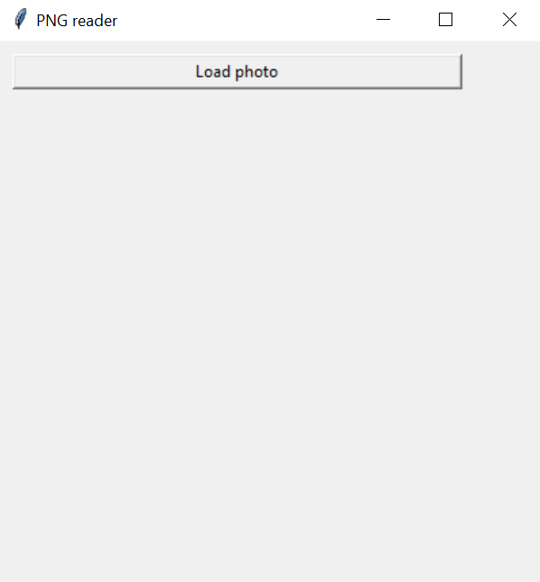
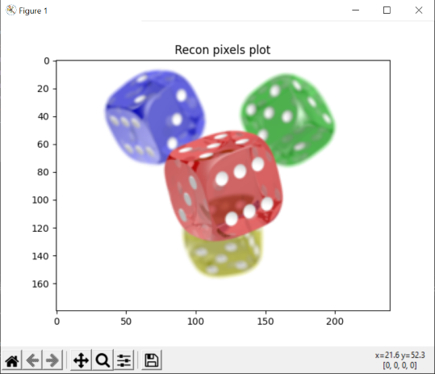
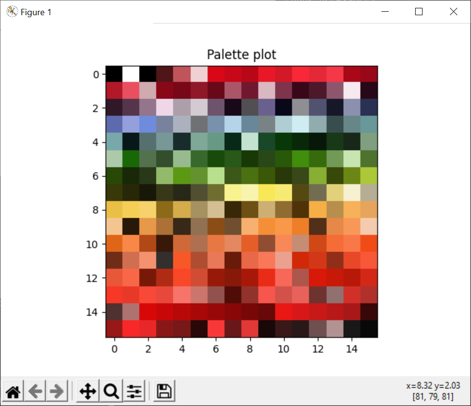
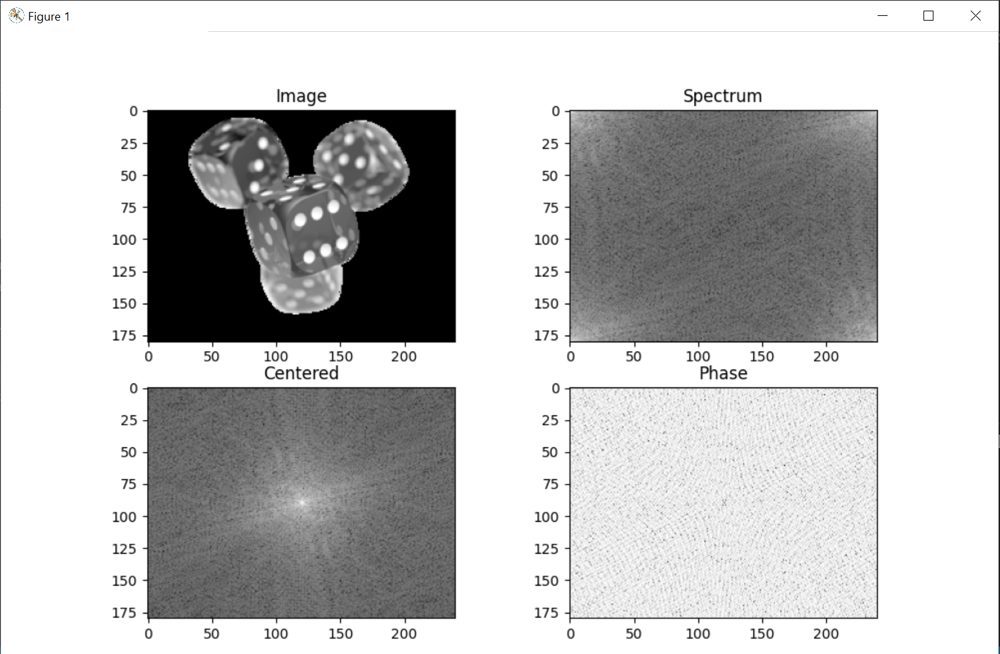
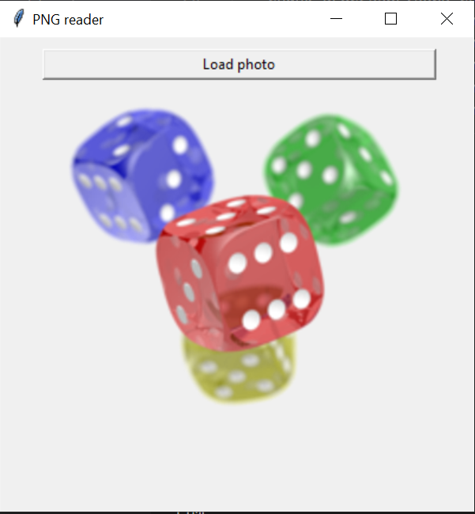

# E-media Project 1

The project is a png image parser. It was made for an E-media course on the studies of Control Engineering and Robotics at the Wrocław University of Technology and Technology.
## Requirements

- matplotlib
- tkinter
- tabulate

## PNG Chunks

| Length  | Chunk type |  Chunk data  |   CRC   |
|---------|------------|--------------|---------|
| 4 bytes | 4 bytes    | Length bytes | 4 bytes |

## All Critical chunks parser can decode:

- **IHDR** : must be the first chunk; it contains (in this order) the image's width,
        height, bit depth, color type, compression method, filter method, and
        interlace method (13 data bytes total).

- **PLTE** : contains the palette; list of colors.

- **IDAT** : contains the image, which may be split among multiple IDAT chunks.
        Such splitting increases filesize slightly, but makes it possible to
        generate a PNG in a streaming manner. The IDAT chunk contains the
        actual image data, which is the output stream of the compression
        algorithm.

- **IEND** : marks the image end.

## Ancillary chunks, which parser can decode:

- **cHRM** : gives the chromaticity coordinates of the display primaries and white
        point.

- **gAMA** : specifies gamma.

- **iTXt** : contains a keyword and UTF-8 text, with encodings for possible
        compression and translations marked with language tag. The Extensible
        Metadata Platform (XMP) uses this chunk with a keyword
        'XML:com.adobe.xmp'

- **zTXt** : contains compressed text (and a compression method marker) with the same limits as tEXt.

- **sRGB** : indicates that the standard sRGB color space is used.

- **tEXt** : can store text that can be represented in ISO/IEC 8859-1, with one
        key-value pair for each chunk. The "key" must be between 1 and 79
        characters long. Separator is a null character. The "value" can be any
        length, including zero up to the maximum permissible chunk size minus
        the length of the keyword and separator. Neither "key" nor "value" can
        contain null character. Leading or trailing spaces are also disallowed.

- **tIME** : stores the time that the image was last changed.

## How to run

1. In command line write:

```shell
python main.py
```

2. You will see GUI, press button 'load photo'. GUI can only load png files:



3. Afterload png file you will see processed chunks:

For example cubes.png:

```shell
[b'IHDR', b'gAMA', b'cHRM', b'bKGD', b'tIME', b'IDAT', b'IDAT', b'tEXt', b'tEXt', b'IEND']

IHDR:

Width of image 240 and height of image 180
Bit depth of image: 8
PNG Image Type: Truecolor with alpha
Compression method: 0
Filter method: 0
Interlace method: 0

IDAT:

Recon pixels are shown by matplotlib on Figure 1

Pixels are filtered and shown

PLTE chunk is optional

gAMA:

The value of decoded gamma is 0.45455

cHRM:

Table of chromaticity values:
-  ----  -----  ----  -----------
   Red   Green  Blue  White Point
x  0.64  0.3    0.15  0.3127
y  0.33  0.6    0.06  0.329
-  ----  -----  ----  -----------

tEXt:

Keyword: date:create
Data: 2020-09-26T19:16:45+00:00


tEXt:

Keyword: date:modify
Data: 2020-09-26T19:16:45+00:00


tIME:

Last modification date: 26.09.2020 19:16:45

IEND:
IEND is empty
```

Recon pixels:



If the image has PLTE(cubes.png doesn't have) chunk you will see a processed palette:



4. After processed chunks you will see Fast Fourier transform of the loaded image png:



5. At the end you will see saved png image only with critical chunks in GPU:



## Bibliography

- https://pyokagan.name/blog/2019-10-14-png/
- http://www.libpng.org/pub/png/spec/1.2/PNG-Chunks.html
- https://github.com/Hedroed/png-parser
- https://stackoverflow.com/questions/1089662/python-inflate-and-deflate-implementations
- https://stackoverflow.com/questions/44497352/printing-one-color-using-imshow
